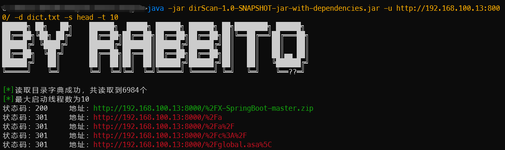

# dirScan
目录扫描的小工具，没啥优点，速度还算可以

### 使用：

```
Usage: <main class> [options]
  Options:
    --dict, -d
      字典
      Default: dict.txt
    help, --help
      查看帮助信息
  * --scanType, -s
      扫描类型，head或者get
    --threads, -t
      线程数
      Default: 100
    --timeOut, -to
      线程数
      Default: 200
  * --url, -u
      目标地址
```


### 使用效果：



